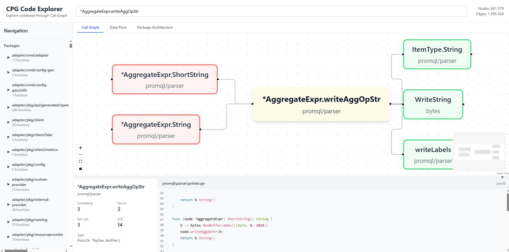
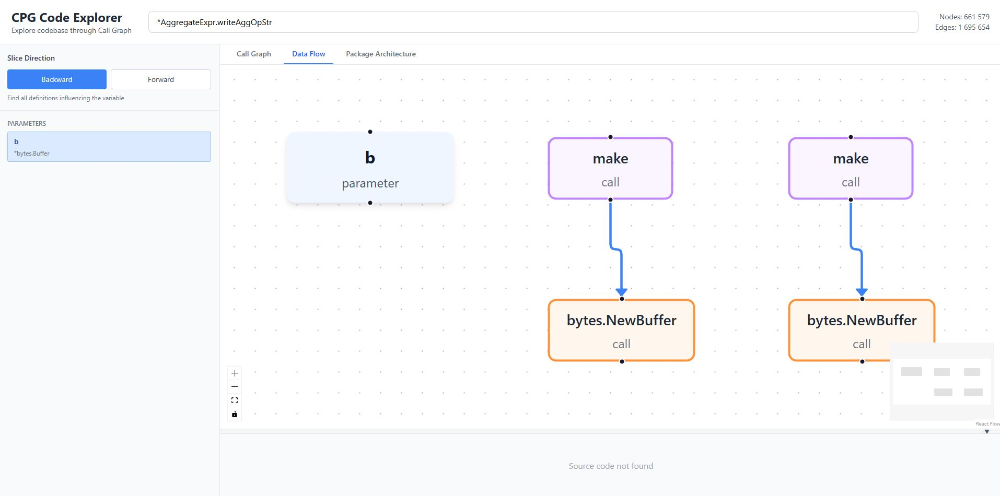

# CPG Code Explorer

Web application for exploring Go codebase through Code Property Graph (CPG) with focus on Call Graph Explorer.

## Features

### Modes

- **Call Graph Mode**: Interactive visualization of function call graphs
  - View callers (who calls the function) and callees (who the function calls)
  - Transitive call chains
  - Graph navigation through node clicks

- **Data Flow Mode**: Data flow analysis through variables
  - View function variables (parameters, locals, return values)
  - Backward slice: track data sources (where value is defined)
  - Forward slice: track data usage (where value is used)
  - Highlight corresponding lines in source code

### Main Features

- **Function Search**: Fast function name search with debouncing
- **Package Navigation**: Accordion navigation with inline function expansion under selected package
- **Source Code View**: Display source code with Go syntax highlighting and highlighting of lines from data flow slice
- **Function Metrics**: Display complexity (cyclomatic complexity), fan-in, fan-out, LOC
- **Resizable Sidebar**: Ability to change sidebar width to view long names





## Tech Stack

- **Frontend**: React + TypeScript + Vite
- **Backend**: Node.js + Express + TypeScript
- **Database**: SQLite (better-sqlite3)
- **Graph Visualization**: @xyflow/react (React Flow) + dagre for layout
- **Styling**: Tailwind CSS

## Requirements

- Docker and Docker Compose
- CPG database (see [SETUP_DB.md](./SETUP_DB.md))

> 📖 **Detailed Docker instructions**: See [DOCKER.md](./DOCKER.md) for detailed setup and troubleshooting instructions

## Quick Start

### 1. Database Setup

Follow instructions in [SETUP_DB.md](./SETUP_DB.md) to generate the CPG database.

After generation, copy the `cpg.db` file to the `data/` folder:

```bash
mkdir -p data
cp ../cpg-test-release/cpg.db data/cpg.db
```

### 2. Running with Docker Compose

**Important:** Make sure the `data/cpg.db` file exists before starting!

```bash
# Check database file exists
ls -lh data/cpg.db

# Run in background
docker compose up -d

# Or run with logs
docker compose up
```

The application will be available at:
- **Frontend**: http://localhost:3000
- **Backend API**: http://localhost:3001
- **Health check**: http://localhost:3001/health

#### Useful Docker Compose Commands

```bash
# Stop containers
docker compose down

# Rebuild images (after code changes)
docker compose up --build

# View logs
docker compose logs -f

# View backend logs only
docker compose logs -f backend

# View frontend logs only
docker compose logs -f frontend

# Stop and remove containers, volumes and networks
docker compose down -v

# Check container status
docker compose ps
```

## Development

### Backend

```bash
cd backend
npm install
npm run dev
```

Backend will run on port 3001.

### Frontend

```bash
cd frontend
npm install
npm run dev
```

Frontend will run on port 3000.

## Usage

### Call Graph Mode

1. **Search function**: Enter function name in search bar or select from package list
2. **Select function**: Click on function in search results or package list
3. **View graph**: Call graph will display in center panel
   - Yellow node — selected function
   - Red nodes — functions that call the selected one (callers)
   - Green nodes — functions called by the selected one (callees)
4. **Navigation**: Click on any graph node to navigate to another function
5. **Source code**: Source code of selected function displays in right panel

### Data Flow Mode

1. **Switch mode**: Select "Data Flow" tab at the top of the interface
2. **Select function**: Choose function from search or package list
3. **Select variable**: In left panel, select a variable (parameter, local or return value)
4. **Select direction**: Click "Backward" to track sources or "Forward" to track usages
5. **View slice**: Data flow graph will display in center panel
   - Blue node — selected variable (origin)
   - Purple nodes — definitions (def)
   - Orange nodes — uses
6. **Code highlighting**: Corresponding lines in source code will be highlighted

## Architecture

> 📚 **Detailed architecture description**: See [ARCHITECTURE.md](./ARCHITECTURE.md) for detailed project structure, decisions and rationale

### Backend API

- `GET /api/functions/search?q=...&limit=50` - Search functions
- `GET /api/functions/:id` - Function details
- `GET /api/graph/:id/neighborhood` - Function callers and callees
- `GET /api/graph/:id/call-chain?depth=5` - Transitive call chain
- `GET /api/graph/:id/callers?depth=3` - All function callers
- `GET /api/dataflow/:functionId/variables` - Function variables
- `GET /api/dataflow/:nodeId/backward-slice` - Backward slice (definitions)
- `GET /api/dataflow/:nodeId/forward-slice` - Forward slice (usages)
- `GET /api/sources/:file` - File source code
- `GET /api/packages` - Package list
- `GET /api/packages/:name/functions` - Package functions
- `GET /api/stats` - Overall statistics

### Frontend Components

- `SearchBar` - Function search with debouncing
- `Sidebar` - Accordion package navigation with inline function expansion (resizable)
- `GraphView` - Call graph or data flow visualization (React Flow with custom nodes)
- `SourcePanel` - Source code view with syntax highlighting and highlighting of lines from data flow slice
- `FunctionDetails` - Function details with metrics (complexity, fan-in, fan-out, LOC)
- `DataFlowPanel` - Function variable selection and slice direction (backward/forward)

## Key Decisions

1. **React Flow (@xyflow/react)**: Modern library for graph visualization with support for custom nodes, zoom, pan, minimap
2. **Dagre layout**: Hierarchical layout for graphs (top to bottom or left to right)
3. **better-sqlite3**: Synchronous access, fast for read-only operations
4. **TanStack Query**: Client-side API request caching (staleTime: 5 minutes)
5. **Depth limiting**: All recursive queries are limited (depth 5-20 depending on query type)
6. **Prepared statements**: SQL query caching on backend for frequently used operations
7. **Accordion navigation**: Inline function expansion under package for improved UX
8. **URL encoding**: Correct handling of IDs with special characters (/, :, ::)
9. **Parameterized queries**: SQL injection protection for all queries with dynamic parameters

## Performance

The application is optimized for working with large database (~900 MB, 555,000 nodes, 1,500,000 edges):

- Prepared statements for frequently used queries
- Client-side caching via TanStack Query
- Lazy data loading (only when needed)
- Subgraph size limiting (10-60 nodes)

## License

ISC
